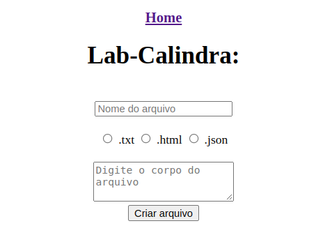

# Abstração HTTP - Servidor de Arquivos

<div id="inicio" align=center>
  &#9734;&nbsp;&nbsp;<a href="#como">Como Utilizar</a>&nbsp;&nbsp;
  <a href="#contribuir">Como contribuir</a>&nbsp;&nbsp;
  <a href="#grupo">Autor</a>&nbsp;&nbsp;&#9734;
</div>

## Descrição da aplicação

Proposta de projeto passada por Guilherme Martins durante o Calindra Programa onde a aplicação é uma abstração do protocolo HTTP, na qual é um ambiente para simular um servidor de entrega, criação e exclusão de arquivos.

<br>

## Ferramentas utilizadas

- Javascript com NodeJS
- módulo "net"
- módulo "fs"
- Git

<br>

<h2 id="como"> Como usar o meu projeto </h2>

Rode o comando abaixo no terminal para clonar o repositório para uma pasta em seu computador/notebook:

```bash
git clone https://github.com/ytallobruno/entrega-arquivos.git
```

Logo em seguida, abra o projeto no editor de texto da sua preferência (VScode, Sublime Text etc).

<br>

## Inicialização da aplicação via terminal

Para inicio da aplicação basta abrir o terminal na pasta do projeto e executar o código abaixo:

```bash
npm start
```

E então abra seu navegador no seguinte endereço:

```bash
localhost:4002
```

### Observação importante

A versão NodeJs utilizada para desenvolvimento é a 16.x LTS. É necessário a instalação de versão igual ou superior para a perfeita execução.

<br>

## Métodos

### Get

Solicita uma representação do recurso solicitado. Caso não existe, retornará o status 404. <br>
Para utilizar, basta digitar em seu browser:

```bash
localhost:4002/nomeDoArquivo.extensao
```

Obs.: caso tenha dúvidas, ao acessar localhost:4002 no browser, será redicionado para uma página inicial com instruções. <br>
Obs².: Esse método também pode ser utilizado via terminal com auxilio do telnet. Visite o método DELETE para mais informações sobre

<br>

### Post:

Envia dados para serem processados (ex: dado de um formulário html) para o recurso especificado. No caso desta aplicação, cria o arquivo solicitado.
<br>
Para utilizar, basta clicar no link na página inicial do servidor, onde terá acesso ao formulário de criação abaixo:



### Delete

Como seu próprio nome já deixa implícito, esse método exclui/deleta um arquivo existente no diretório.
<br>
Para utilizá-lo, conecte-se ao seu servidor por meio do **telnet** (leia [esse artigo](https://blog.betrybe.com/tecnologia/comando-telnet/)), rodando o comando abaixo em outro terminal:

```bash
telnet 127.0.0.1 4002
```

E então rode esse comando e para excluir o arquivo escolhido:

```bash
DELETE /nomeDoArquivo.extensao HTTP/1.1
```

### Options

Este retorna os métodos que o servidor suporta. Para utilizà-lo, conecte-se ao servidor via telnet (como no item anterior) e então rode o seguinte comando:

```bash
OPTIONS
```
A seguinte mensagem irá surgir em seu terminal:

```bash
GET, POST, DELETE, OPTIONS. Use the following way to get/delete:
METHOD + path (ex.: /fileName.txt ) + HTTP/1.1
```

<br>


<hr>

<h2 id="contribuir">Como contribuir 📫</h2>

Para contribuir com nosso projeto, siga estas etapas:
  >- Bifurque este repositório (fork).
  >- Crie um branch: `git checkout -b <nome_branch>`.
  >- Faça suas alterações e confirme-as: `git commit -m '<mensagem_commit>'`
  >- Envie para o branch original: `git push origin <nome_do_projeto> / <local>`
  >- Crie a solicitação de pull.
*Consulte a documentação do GitHub em* [como criar uma solicitação pull](https://help.github.com/en/github/collaborating-with-issues-and-pull-requests/creating-a-pull-request).

<div id="autor" align="center">
  
  **Criado e desenvolvido por [Ytallo Bruno](https://www.linkedin.com/in/ytallobruno/).**
  
 <div align="center"> 
  <a href="mailto:ytallodev@gmail.com"></a>
   &nbsp;&nbsp;&nbsp;&nbsp;&nbsp;
  <a href="https://github.com/ytallobruno" target="_blank"></a>
   &nbsp;&nbsp;&nbsp;&nbsp;&nbsp;
  <a href="https://www.linkedin.com/in/ytallobruno/" target="_blank"></a>
  </div>
</div>

<br>

<div align="center">
  &#11165;&nbsp;<a href="#inicio"><strong>Voltar ao topo</strong></a>&nbsp;&#11165;
</div>